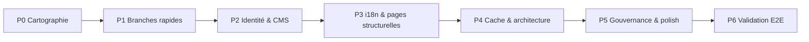

# Plan d'exécution — Connexion globale Admin ↔ Site public CFM ASBL

> **Date** : juillet 2026 · **Dernière mise à jour** : 6 juillet 2026 (V1 validée, V2 en cours)  
> **Objectif** : permettre au tableau de bord admin de **contrôler 100 % du contenu et des réglages visibles sur le site public**, sans intervention manuelle sur le code ni la base de données  
> **Périmètre de ce document** : analyse + plan d'exécution — **suivi d'implémentation ci-dessous**

### Statut d'exécution (6 juil. 2026)

| Phase | Statut | Preuve |
|-------|--------|--------|
| **V1 — Contenu J1** | ✅ Validée | `node scripts/verify-v1-content.mjs` → **6/6** (actus, études, campagnes, presse, témoignages) |
| **J2–J4 — Identité, pages, i18n** | ✅ Implémentée | E2E `scripts/test-admin-site-e2e.mjs` → 5/5 ; panneaux Identité, Pages, Footer |
| **V2 — Communauté** | ✅ Validée | `test-v2-petitions-e2e.mjs` + `test-v2-community.mjs` (4/4) |
| **V3 — Live & mobilisation** | ✅ Implémentée | Cache live, `/actions` RSC, sondages admin, E7 — `test-v3-live-e2e.mjs` |
| **P6 prod** | ⏳ À faire | Déploiement Vercel + checklist prod |

**Écarts V1 mineurs (non bloquants)** : `published_at` news, `sort_order` témoignages, preview PDF admin études/presse.

---
> **Documents liés** : `AdminRecovery.md`, `PLAN-EXECUTION-DETTE.md`, `DesignMediasPlan.md`, `Corrective.md`

---

## 0. Périmètre validé (réponses produit — juillet 2026)

### 0.1 Décisions actées

| # | Question | Réponse validée | Impact sur le plan |
|---|----------|-----------------|-------------------|
| **Q1** | Contrôle global | **C** — contenu éditorial + identité (nom, contact, réseaux) | P2 identité obligatoire ; pas de refonte navigation (hors scope Q1=D) |
| **Q2** | Langues admin | **Non** — overrides admin **FR/EN uniquement** ; LN/SW restent fichiers JSON | P3 réduite ; pas d'éditeur LN/SW ; tests E5 sur FR+EN seulement |
| **Q4** | Preview « voir sur le site » | **Oui** — lien + bypass cache | P4.4 remontée en **P1.6** (livraison précoce) |
| **Q5** | Timeline À propos | **Oui** — blocs CMS admin | P3.2 Option A retenue (`content_blocks`) |
| **Q8** | Affichage partenaires | **Footer** | P1.1 cible `Footer.tsx`, pas `/s-engager` |
| **Q11** | Constantes `SITE` | **Oui** — migration `site_settings` | P2.1 chemin critique |
| **Q12** | Pages légales | **Éditables en admin** (markdown ou WYSIWYG) | P3.4 éditeur dédié FR/EN |
| **Q13** | Priorité #1 | **V1 contenu** (actus, études, campagnes, presse, témoignages) | Semaine 1 = parité CMS contenu avant V2/V3 |
| **Q15** | Contenu sacré | **Aucun** — tout est éditable (citation, mission, etc.) | Pas d'exclusion dans `site_settings` |

### 0.2 Hypothèses par défaut (non répondu — à confirmer si besoin)

| # | Hypothèse retenue |
|---|-------------------|
| Q3 | Utilisateur solo (fondateur / bénévole unique) |
| Q6 | Axes : structure fixe dans le code ; textes via i18n FR/EN + overrides admin |
| Q7 | 26 provinces : référentiel fixe |
| Q9 | Propagation acceptable : **< 5 s en preview** ; TTL cache 300 s en navigation normale |
| Q10 | Validation : local PG puis prod `cfm-asbl.vercel.app` |

### 0.3 Recommandation calendrier (Q14)

**Horizon recommandé : 5 semaines** (1 développeur, temps plein).

| Jalons | Semaine | Livrable métier |
|--------|---------|-----------------|
| **J1 — V1 connecté** | S1 | Contenu éditorial 100 % parité admin ↔ site |
| **J2 — Identité + Footer** | S2 | `SITE` en admin ; partenaires + réseaux sociaux dans le Footer |
| **J3 — Pages pilotables** | S3 | Timeline about + pages légales + preview admin |
| **J4 — i18n FR/EN** | S4 | Overrides visibles Header/Footer + shell |
| **J5 — Prod validée** | S5 | Cache, territoire, tests E2E, déploiement |

**Hors sprint initial (phase 2 ultérieure)** : V2 communauté avancée, V3 live polish, newsletter admin, SEO metadata — à traiter après J5 si le périmètre Q1=C est atteint.

**Pourquoi 5 semaines et pas 2 ou 12 ?**
- **2 sem.** : irréaliste (CMS blocs + légal + identité + preview + i18n shell).
- **4 sem.** : faisable en mode minimal mais sans marge tests prod.
- **5 sem.** : équilibre scope Q1=C + Q5 + Q12 + preview, priorité V1.
- **8–12 sem.** : réservé si extension vers Q1=A/D ou enterprise complet (AdminRecovery 100 %).

### 0.4 Périmètre IN / OUT

| IN (obligatoire) | OUT (reporté phase 2) |
|-----------------|----------------------|
| Contenu V1 CRUD complet + affichage site | Navigation éditable (menus dynamiques) |
| Identité `SITE` → admin | Overrides i18n LN/SW |
| Partenaires dans Footer | Page `/partenaires` dédiée |
| Réseaux sociaux Footer ← admin | CRUD pétitions avancé (si V1 suffit) |
| Timeline about + pages légales CMS | Newsletter gestion liste |
| Preview admin | Live WebSocket / streaming natif |
| i18n overrides FR/EN (shell + pages) | Stats homepage CMS (si non critique V1) |
| Preview + invalidation cache | Audit enterprise complet |

---

## 1. Synthèse exécutive

### 1.1 Objectif produit

> **Un centre de commandement unique** : toute modification faite dans `/admin/dashboard` se reflète sur le site public `cfmasbl.com` (ou équivalent), pour chaque entité métier, chaque langue concernée, et chaque réglage d'affichage.

### 1.2 Score actuel estimé — connexion admin → site

| Domaine | Score connexion | Commentaire |
|---------|-----------------|-------------|
| Contenu éditorial (actus, études, campagnes, presse, témoignages) | **~85 %** | CRUD admin + lectures site OK ; champs partiels (catégorie, alt) |
| Médias & design (hero, galerie, axes, OG, favicon) | **~90 %** | Bien branché via `site_settings` + invalidation `media` |
| Live & mobilisation | **~90 %** | Admin ↔ site OK ; cache tag `live` non consommé côté lecture |
| Communauté (membres, familles, pétitions) | **~70 %** | Pétitions : create only admin ; site lit le store |
| Dons & transparence | **~85 %** | Toggle `donors_public` fonctionne |
| Inbox (aide, adhésions) | **~75 %** | Workflows partiels ; contact en lecture seule |
| i18n overrides | **~45 %** | Server pages seulement ; Header/Footer/client ignorés |
| Identité & constantes (`SITE`) | **~5 %** | Hardcodé `constants.ts` ; admin ne peut pas modifier |
| Partenaires | **~0 % côté site** | Admin CRUD complet ; **aucune page publique** |
| Réseaux sociaux | **~0 % côté site** | Sauvegardés en admin ; Footer hardcodé |
| Pages structurelles (about timeline, stats home, légal) | **~0 %** | Hardcodé ou i18n fichiers uniquement |

**Score global connexion admin ↔ site** : **~58 %**  
**Cible** : **100 %** sur le périmètre **§0.4 IN** (contenu V1 + identité + Footer + CMS pages + i18n FR/EN + preview).

### 1.3 Architecture actuelle (rappel)

```
Admin UI  →  /api/admin/*  →  withStoreMutation  →  PostgreSQL / store.json
                                    ↓
                         invalidateContentCache | invalidateMediaCache | invalidateI18nCache
                                    ↓
Site public  →  lectures cachées (TTL ~300 s)  →  store
             →  constants.ts (NON branché admin)
             →  composants client (NON branchés i18n overrides)
```

### 1.4 Principe directeur de la refonte connexion

1. **Une source de vérité** : tout ce qui est visible sur le site vit dans le store (`site_settings` + tables contenu), pas dans `constants.ts` ni en dur dans les pages.
2. **Écriture admin → invalidation explicite** : chaque mutation admin déclenche le bon tag cache (matrice section 6).
3. **Lecture site unifiée** : remplacer les imports `SITE` / textes hardcodés par des lecteurs serveur (`getSiteConfig()`, `getPartners()`, etc.).
4. **Cohérence i18n FR/EN** : overrides admin visibles sur shell + pages serveur + composants client (LN/SW : fichiers JSON uniquement).
5. **Parité admin ↔ schéma** : chaque champ affiché sur le site est éditable dans le panneau admin correspondant.

---

## 2. Matrice complète — entité par entité

Légende : ✅ connecté · ⚠️ partiel · ❌ déconnecté

| Entité | Admin (section) | Capacité admin | Site (page/composant) | Lecture store | Gap principal | Phase |
|--------|-----------------|----------------|----------------------|---------------|---------------|-------|
| Actualités | Contenu | CRUD + publish | `/`, `/actualites/*`, `/plaidoyer` | ✅ | Champs `category`, `cover_image_alt` absents UI | P2 |
| Études | Contenu | CRUD + publish | `/plaidoyer` | ✅ | — | — |
| Campagnes | Contenu | CRUD + publish | `/plaidoyer` | ⚠️ | Image sans resolver média | P1 |
| Communiqués presse | Contenu | CRUD + publish | `/presse` | ✅ | — | — |
| Témoignages | Contenu | CRUD + publish | `/` (carousel) | ✅ | — | — |
| Actions territoire | Territoire | Create + delete | `/actions` (client fetch) | ⚠️ | Pas d'édition, pas de photo ; page client sans i18n overrides | P1–P3 |
| Live | Live | CRUD complet | `/live`, `/`, badge | ✅ | Cache tag inutilisé | P4 |
| Pétitions | Communauté | Create only | `/petitions/*` | ✅ | Pas edit/deactivate en UI | P2 |
| Partenaires | Partenaires | CRUD complet | `Footer` | ❌ | Admin OK ; site n'affiche pas encore | P1 |
| Membres / familles | Communauté | Activate, liens | `/membre/*` | ✅ | Hors site marketing | — |
| Dons | Dons | Statut + toggle public | `DonationTransparency` | ✅ | — | — |
| Aide confidentielle | Inbox | Statut + note | Formulaire `/contact` | ✅ | — | — |
| Contact | Inbox | Lecture seule | Formulaire `/contact` | ✅ | Pas workflow archive/export inbox | P2 |
| Adhésions | Inbox | Approve/reject | `/s-engager` | ✅ | — | — |
| Newsletter | Overview/export | Export CSV | Footer, pages | ✅ | Pas gestion liste admin | P5 |
| Hero / mission | Design | Upload + assign | `/` | ✅ | — | — |
| Galerie FIKIN | Design | Collections | `/a-propos`, `/plaidoyer` | ✅ | — | — |
| Images axes | Design | Collections | `/`, `/axes` | ⚠️ | Hero `/axes` hardcodé SVG | P1 |
| Defaults médias | Design | Defaults | Résolveurs globaux | ✅ | — | — |
| Press kit | Design | Press | `/presse` | ✅ | — | — |
| OG / favicon | Design | Defaults | `layout.tsx` metadata | ✅ | Keywords metadata hardcodés | P5 |
| i18n overrides | Langues | Clé/valeur manuel | Pages `getTranslations()` | ⚠️ | Header, Footer, client | P3 |
| Réseaux sociaux | Langues/settings | PATCH settings | Footer | ❌ | URLs hardcodées Footer | P1 |
| Identité SITE | — | ❌ | Partout | ❌ | `constants.ts` | P2 |
| Timeline à propos | Pages structurelles | ❌ (à créer) | `/a-propos` | ❌ | Tableau hardcodé → CMS Q5 | P3 |
| Stats homepage | — | ❌ | `/` | ❌ | Compteurs hardcodés | Phase 2 (hors J5) |
| Axes (structure) | — | ❌ | `/`, `/axes` | ❌ | `AXES` constant ; textes i18n FR/EN | P3 (textes) |
| Pages légales | Pages structurelles | ❌ (à créer) | `/confidentialite`, `/mentions-legales` | ❌ | Corps hardcodé → CMS Q12 | P3 |
| Provinces RDC | Territoire (ref) | Liste fixe | `/actions`, formulaires | ✅ | Référentiel OK en dur | — |

---

## 3. Phases d'exécution

### Vue d'ensemble



| Phase | Nom | Durée estimée | Dépend de |
|-------|-----|---------------|-----------|
| P0 | Cadrage & baseline | ✅ fait | Réponses §0 |
| P1 | V1 + branches rapides (Footer, preview) | 5–7 j | P0 |
| P2 | Identité site & CMS V1 parité | 5–7 j | P0 (priorité V1) |
| P3 | i18n FR/EN + pages structurelles + légal | 5–7 j | P2 |
| P4 | Cache & architecture lectures | 3–4 j | P1 |
| P5 | Workflows inbox, newsletter, metadata | 3–5 j | **Phase 2** (post-J5) |
| P6 | Validation bout-en-bout & prod | 2–3 j | P1–P4 |

**Total estimé validé** : **5 semaines** (1 dev) — voir §0.3.

---

### Phase P0 — Cadrage & baseline ✅

**Statut** : **terminé** (réponses §0 actées juillet 2026).

#### Critères de sortie P0

- [x] Périmètre « éditable admin » listé (§0.4 IN/OUT)
- [x] Priorité V1 confirmée (Q13)
- [x] Calendrier 5 semaines recommandé (Q14)
- [x] Environnement de test : local PG → prod Vercel (Q10 validé)

---

### Phase P1 — V1 prioritaire + Footer + preview (5–7 jours)

**Objectif** : boucler la **priorité V1** (contenu éditorial) et connecter Footer (partenaires + réseaux) + preview admin.

> **Ordre d'exécution interne** : P1.0 (V1) → P1.1–P1.2 (Footer) → P1.6 (preview) → P1.3–P1.5 (compléments).

#### P1.0 — Contenu V1 : parité schéma (PRIORITÉ Q13)

| Entité | Champs à ajouter UI admin |
|--------|---------------------------|
| News | `category`, `cover_image_alt`, `published_at` (optionnel) |
| Studies | Vérifier `file_url` + preview PDF |
| Campaigns | `description` longue ; image via resolver |
| Press | `file_url` validation + preview |
| Testimonials | `sort_order` (optionnel) |

| Étape | Détail |
|-------|--------|
| Admin | Compléter `ContentPanel` pour tous les champs store |
| Site | Vérifier chaque type sur sa page (`/`, `/plaidoyer`, `/presse`, `/actualites/[slug]`) |
| Test E2E | E1 : créer actualité → visible homepage + slug |

#### P1.1 — Partenaires dans le Footer

| Étape | Détail |
|-------|--------|
| Lecture | Créer `getPartnersCached()` consommant `store.partners` + tag `cfm:partners` |
| Affichage | Bandeau logos partenaires dans **`Footer.tsx`** (Q8) — liens `website` si présents |
| Médias | Logos via `resolveMediaPath` |
| Admin | Bouton « Voir dans le Footer » depuis `PartnersPanel` |
| Test | CRUD partenaire admin → visible Footer après preview ou TTL |

#### P1.2 — Réseaux sociaux Footer ← `site_settings.social_links`

| Étape | Détail |
|-------|--------|
| Lecture | `getSocialLinks()` depuis `site_settings` (cache media-settings ou config dédiée) |
| Site | Remplacer URLs hardcodées dans `Footer.tsx` |
| Admin | Panneau i18n/settings existant — vérifier champs Facebook, X, YouTube, LinkedIn |
| Invalidation | PATCH `social_links` → tag approprié (pas seulement `media` si sémantique différente) |

#### P1.3 — Campagnes plaidoyer : résolution images

| Étape | Détail |
|-------|--------|
| Site | `/plaidoyer` : utiliser `getResolvedNewsCover(campaign.image_url)` |
| Test | Changer image campagne en admin → plaidoyer mis à jour |

#### P1.4 — Territoire : édition actions + photo

| Étape | Détail |
|-------|--------|
| Admin | `TerritoryPanel` : formulaire édition (PATCH) + `MediaPicker` pour `photo` |
| API | Étendre `POST /api/admin` ou route REST dédiée `actions/[id]` |
| Site | `/actions` : afficher photo si présente |
| Invalidation | `invalidateContentCache("actions")` sur mutation |

#### P1.5 — Hero page Axes pilotable

| Étape | Détail |
|-------|--------|
| Settings | Clé `axes_hero_image` dans `site_settings` |
| Admin | Champ dans Design → Defaults |
| Site | `/axes` : remplacer SVG hardcodé par resolver |

#### P1.6 — Preview admin « Voir sur le site » (Q4)

| Étape | Détail |
|-------|--------|
| UX | Bouton sur chaque panneau (Contenu, Partenaires, Design, Pages) ouvrant l'URL publique |
| Technique | `?preview=1` + cookie session admin → `revalidateTag` ciblé ou `cache: 'no-store'` |
| Cible | Propagation **< 5 s** en mode preview (Q9) |
| Pages | Mapping entité → URL (`news` → `/actualites/[slug]`, partenaire → `/#footer` ou `/` avec ancre) |

#### Critères de sortie P1

- [x] **V1** : tous types contenu créés en admin visibles sur le site (E1) — `verify-v1-content.mjs`
- [x] Partenaires visibles dans le **Footer**
- [x] Footer reflète `social_links` admin (E9)
- [x] Preview admin fonctionnel sur au moins contenu + Footer
- [x] Aucune régression build / tests existants (70 Vitest)

---

### Phase P2 — Identité site & CMS complet (5–8 jours)

**Objectif** : l'admin contrôle l'identité de l'organisation et tous les champs contenu supportés par le schéma.

#### P2.1 — Migration `SITE` → `site_settings`

| Champ actuel (`constants.ts`) | Clé `site_settings` proposée | Éditable admin |
|------------------------------|------------------------------|----------------|
| `name` | `site_name` | ✅ |
| `sigle` | `site_sigle` | ✅ |
| `tagline` | `site_tagline` | ✅ |
| `quote` | `site_quote` | ✅ (Q15 : éditable) |
| `founder` | `site_founder` | ✅ |
| `founded` | `site_founded` | ✅ |
| `country` | `site_country` | ✅ |
| `email` | `site_email` | ✅ |
| `phone` | `site_phone` | ✅ (fallback env si vide) |

| Étape | Détail |
|-------|--------|
| Schéma | Étendre `site_settings` + seed / migration PG |
| Lecteur | `getSiteConfig()` avec cache dédié `cfm:site-config` |
| Site | Remplacer progressivement `SITE.*` par `getSiteConfig()` (metadata, contact, about, footer) |
| Admin | Nouveau panneau **« Identité & contact »** ou section dans Langues/settings |
| Invalidation | `invalidateSiteConfigCache()` sur PATCH |

#### P2.2 — Content panel : parité schéma

> Si P1.0 livré en S1, P2.2 = validation + champs restants uniquement.

| Entité | Vérification |
|--------|--------------|
| News | `category`, `cover_image_alt` |
| Campaigns | resolver image plaidoyer |
| Press | preview PDF |

#### P2.3 — Pétitions : CRUD complet

**Report phase 2** (priorité V1) — sauf si temps restant en S5.

#### P2.4 — Inbox contact : workflow minimal

**Report phase 2** (P5) — hors périmètre J5.

#### Critères de sortie P2

- [x] Nom, email, téléphone, citation modifiables en admin → contact + metadata site (E4)
- [x] `SITE` n'est plus source de vérité (fallback dev uniquement)
- [x] V1 contenu validé bout-en-bout

---

### Phase P3 — i18n FR/EN + pages structurelles + légal (5–7 jours)

**Objectif** : overrides admin **FR/EN uniquement** (Q2) ; timeline about (Q5) ; pages légales éditables (Q12).

#### P3.1 — Unifier i18n FR/EN (serveur + client + shell)

| Composant / zone | Solution cible |
|------------------|----------------|
| `Header.tsx`, `Footer.tsx` | `I18nProvider` ou `getTranslations()` |
| Pages client (`/actions`, formulaires) | Context hydraté depuis layout |
| Admin i18n panel | Navigateur clés ; **locales éditables : `fr`, `en` seulement** |
| LN/SW | Inchangés : `messages/ln.json`, `messages/sw.json` (pas d'override admin) |

#### P3.2 — Blocs CMS pages structurelles (Q5 = Oui)

Structure `site_settings.content_blocks` :

```json
{
  "about_timeline": {
    "fr": [{ "date": "2018", "title": "...", "description": "..." }],
    "en": [{ "date": "2018", "title": "...", "description": "..." }]
  },
  "legal_privacy": { "fr": "markdown…", "en": "markdown…" },
  "legal_mentions": { "fr": "markdown…", "en": "markdown…" }
}
```

| Étape | Détail |
|-------|--------|
| Admin | Panneau **« Pages structurelles »** : éditeur timeline (liste réordonnable) + légal (markdown FR/EN) |
| Site | `/a-propos` lit `about_timeline[locale]` ; `/confidentialite`, `/mentions-legales` lisent blocs légal |
| Invalidation | Tag `cfm:site-config` ou `cfm:content-blocks` dédié |
| Preview | Bouton preview par page (P1.6) |

#### P3.3 — Axes stratégiques (Q6 hypothèse)

- Structure (`slug`, `icon`) : reste `AXES` dans le code
- Textes : overrides i18n FR/EN via panneau Langues (pas de CRUD axes)

#### P3.4 — Pages légales (Q12 = admin)

| Étape | Détail |
|-------|--------|
| Admin | Éditeur markdown par page × locale (FR/EN) |
| Site | Rendu markdown sécurisé (pas de HTML brut non filtré) |
| SEO | `generateMetadata` lit titre depuis bloc ou i18n |

#### Critères de sortie P3

- [x] Override i18n FR **et** EN visible sur Header + Footer (E5)
- [x] Timeline about modifiable en admin → `/a-propos`
- [x] Pages légales modifiables en admin → `/confidentialite`, `/mentions-legales`
- [x] LN/SW : pas de régression (lecture JSON inchangée)

---

### Phase P4 — Cache & architecture lectures (3–5 jours)

**Objectif** : cohérence technique admin → invalidation → site, sans angles morts.

#### P4.1 — Matrice invalidation (à implémenter)

| Mutation admin | Tag(s) à invalider | Lecteur site |
|----------------|-------------------|--------------|
| Content CRUD | `cfm:content` + table | `content-cache.ts` |
| `site_settings` médias | `cfm:media-settings` | `media-cache.ts` |
| `site_settings` identité | `cfm:site-config` (nouveau) | `getSiteConfig()` |
| `social_links` | `cfm:site-config` ou `media-settings` | Footer |
| i18n overrides | `cfm:i18n` | `i18n-overrides.server` + client context |
| partners | `cfm:partners` | `getPartnersCached()` |
| live | `cfm:live` | `getLiveEventsCached()` (à créer) |
| petitions | `cfm:petitions` | `getActivePetitionsCached()` |
| donations status | aucun (lecture directe) | documenté |
| inbox status | aucun | documenté |

#### P4.2 — Corriger `PATCH /api/admin/settings`

Problème actuel : tout PATCH invalide `media` uniquement.

| Étape | Détail |
|-------|--------|
| Refactor | `invalidate` par clé patchée (`donors_public` → none ou dédié ; `social_links` → site-config) |
| Tests | Vitest sur mapping clé → tag |

#### P4.3 — Server-render `/actions`

| Étape | Détail |
|-------|--------|
| Site | Convertir page en RSC ; liste depuis `getActionsCached()` |
| Bénéfice | Cache contenu + i18n overrides sur la page |

#### P4.4 — Preview admin (Q4 — compléter P1.6)

| Étape | Détail |
|-------|--------|
| Middleware | Détecter `?preview=1` + cookie admin valide |
| Cache | Bypass ou revalidation immédiate des tags concernés |
| Sécurité | Preview réservé aux sessions admin (pas public anonyme) |

#### Critères de sortie P4

- [x] Matrice invalidation documentée et appliquée
- [x] Tags `partners`, `petitions`, `live` consommés (`getPartnersCached`, `getActivePetitionsCached`, `getLiveEventsCached`)
- [x] `/actions` en RSC (données via `getActionsCached`, filtre client uniquement)

---

### Phase P5 — Workflows, gouvernance & polish (phase 2 — V2 communauté)

**Statut** : **finalisée** (6 juil. 2026).

| Livrable V2 | Statut | Détail |
|-------------|--------|--------|
| Pétitions CRUD admin | ✅ | `PATCH/DELETE /api/admin/petitions/[id]`, UI Communauté (edit, publier/dépublier, supprimer, preview) |
| Export signatures pétitions | ✅ | Lien CSV par pétition dans Communauté |
| Cache pétitions site | ✅ | `getActivePetitionsCached` + tag `cfm:petitions` |
| Inbox contact workflow | ✅ | Statuts `new` / `read` / `archived`, actions admin, export CSV |
| Test E6 | ✅ | `node scripts/test-v2-petitions-e2e.mjs` |
| Dons reconciliation | ✅ | Réf. PayDunya, validation manuelle, reçu email, preview `/s-engager`, toggle E8 |
| Newsletter admin | ✅ | Liste, recherche, export CSV, retrait abonné (`DELETE /api/admin/newsletter/[id]`) |
| Export membres | ✅ | `GET /api/admin/export/users` |
| SEO metadata admin | ⏳ | Reporté V3/P6 |

**Hors V2** (V3+) : polish live, `/actions` RSC, prod E6–E10.

---

### Phase V3 — Live & mobilisation (AdminRecovery Phase E)

**Statut** : **finalisée** (6 juil. 2026).

| Livrable V3 | Statut | Détail |
|-------------|--------|--------|
| Cache live site | ✅ | `live-cache.ts` — homepage, `/live`, `/live/[slug]` |
| Édition live complète | ✅ | Titre, description, stream/replay, miniature (existant + preview) |
| Badge chat pending | ✅ | Compteur par événement dans AdminV3Panel |
| Historique chat + modération bulk | ✅ | Actions `all_chat` / `pending_chat` |
| Sondages — fermer + export CSV | ✅ | `PATCH/GET /api/admin/live/polls/[id]` |
| Push templates | ✅ | Modèles Live / Campagne / Aide |
| Replay éditable | ✅ | Champ `replay_url` (plus de hardcode) |
| `/actions` RSC | ✅ | `getActionsCached` côté serveur |
| Test E7 | ✅ | `node scripts/test-v3-live-e2e.mjs` |

**Suite** : P6 prod (déploiement Vercel + checklist E1–E13).

---

### Phase P6 — Validation bout-en-bout & production (2–3 jours)

**Objectif** : prouver que le dashboard contrôle réellement 100 % du périmètre validé.

#### P6.1 — Scénarios E2E manuels (checklist)

| # | Scénario | Admin | Vérification site |
|---|----------|-------|-------------------|
| E1 | Créer actualité + image | Contenu | Homepage + `/actualites/[slug]` |
| E2 | Modifier hero | Design | Homepage above fold |
| E3 | Ajouter partenaire | Partenaires | **Footer** (toutes pages) |
| E4 | Changer email contact | Identité | `/contact` + Footer |
| E5 | Override i18n clé nav | Langues | Header **FR + EN** (pas LN/SW) |
| E11 | Modifier timeline | Pages structurelles | `/a-propos` |
| E12 | Modifier mentions légales | Pages structurelles | `/confidentialite` FR/EN |
| E13 | Preview après save | Tout panneau | Changement visible < 5 s avec `?preview=1` |
| E6 | Publier/dépublier pétition | Communauté | `/petitions` |
| E7 | Démarrer live | Live | Badge homepage + `/live` |
| E8 | Toggle donateurs publics | Dons | Transparence |
| E9 | Réseaux sociaux | Langues | Footer liens |
| E10 | Action territoire + photo | Territoire | `/actions` |

#### P6.2 — Tests automatisés à ajouter

| Test | Type |
|------|------|
| `getSiteConfig()` retourne settings seed | Vitest |
| PATCH settings invalide bon tag | Vitest |
| Partners repository → public getter | Vitest intégration |
| (Optionnel) Playwright E2E admin → site | Playwright |

#### P6.3 — Déploiement

| Étape | Détail |
|-------|--------|
| Migration PG | Script seed nouvelles clés `site_settings` |
| Vercel | Variables inchangées sauf nouvelles si besoin |
| Doc | Mettre à jour `DEPLOY-VERCEL-SUPABASE.md` section connexion admin-site |
| Validation prod | Exécuter E1–E5 sur `cfm-asbl.vercel.app` |

#### Critères de sortie P6 (Definition of Done globale)

- [ ] 100 % du périmètre section 0 validé couvert par scénarios E2E
- [ ] Aucune URL sociale / identité critique en dur dans le code (hors fallbacks)
- [ ] Build + 70+ tests Vitest verts
- [ ] Checklist prod signée

---

## 4. Nouveau panneau admin proposé (architecture cible)

Navigation dashboard après connexion globale :

```
/admin/dashboard
├── Vue d'ensemble          (inchangé)
├── Boîte de réception      (+ contact workflow P2)
├── Contenu                   (parité schéma P2)
├── Actions & territoire      (+ edit/photo P1)
├── Communauté                (+ pétitions CRUD P2)
├── Dons & transparence       (inchangé)
├── Live & mobilisation       (inchangé)
├── Médias & design           (+ axes hero P1)
├── Identité & contact        (NOUVEAU — P2)  ← ex-SITE
├── Langues & textes          (+ key browser P3)
├── Pages structurelles       (NOUVEAU — P3) timeline + légal FR/EN
├── Partenaires               (+ preview Footer P1)
└── Journal & exports         (inchangé)
```

---

## 5. Risques & mitigations

| Risque | Probabilité | Impact | Mitigation |
|--------|-------------|--------|------------|
| Scope creep | Moyenne | Délais | Périmètre §0.4 IN/OUT verrouillé |
| Régression i18n FR/EN | Moyenne | UX | E5 + smoke LN/SW non régression |
| Cache stale hors preview | Moyenne | Confusion admin | Preview P1.6 obligatoire (Q4) |
| Migration `SITE` casse metadata SEO | Moyenne | SEO | Fallback constants si settings vides |
| Composants client nombreux | Haute | i18n gaps | P3 I18nProvider centralisé |
| Dette `POST /api/admin` monolithique | Moyenne | Maintenance | Nouvelles features en REST ; migrer legacy progressivement |

---

## 6. Dépendances techniques

| Dépendance | Statut | Bloquant pour |
|------------|--------|---------------|
| PostgreSQL / store unifié | ✅ OK | Toutes phases |
| `withStoreMutation` + invalidation | ✅ Partiel | P4 matrice complète |
| Upload médias Supabase | ✅ OK | P1 partenaires logos |
| i18n base JSON | ✅ FR/EN/LN/SW fichiers | P3 (overrides FR/EN seulement) |
| Tests Vitest | ✅ 70/70 | P6 |
| Playwright E2E | ❌ Absent | P6 optionnel |
| Domaine custom | ❌ | Pas bloquant connexion |

---

## 7. Calendrier validé — 5 semaines (Q14)

```
Semaine 1 — J1 V1          : P1.0 contenu parité + tests E1
Semaine 2 — J2 Identité    : P2.1 SITE→admin + P1.1 partenaires Footer + P1.2 social
Semaine 3 — J3 Pages CMS   : P3.2 timeline + P3.4 légal + P1.6 preview
Semaine 4 — J4 i18n FR/EN  : P3.1 shell + P4 cache matrice
Semaine 5 — J5 Prod        : P1.3–P1.5 compléments + P6 E1–E13 + deploy
```

**Chemin critique** : P1.0 (V1) → P2.1 (identité) → P1.1–P1.2 (Footer) → P3 (pages + i18n) → P6.

**Phase 2 (sem. 6+)** : P5 (inbox, newsletter, SEO, pétitions CRUD, stats homepage CMS).

---

## 8. Definition of Done — « Contrôle global »

Le projet est **terminé** lorsque :

1. **Couverture** : chaque ligne §2 du périmètre **IN** (§0.4) marquée ✅.
2. **Traçabilité** : mutations admin → invalidation documentée (§P4.1).
3. **Identité** : `site_settings` source de vérité ; `constants.ts` = fallbacks dev uniquement.
4. **i18n** : overrides admin **FR/EN** sur Header + Footer + pages marketing ; LN/SW inchangés.
5. **Preview** : E13 passe en local et prod.
6. **Tests** : E1–E5, E9, E11–E13 passent ; build + Vitest verts.
7. **Documentation** : `docs/TEST-ADMIN-SITE-E2E.md` rédigé en P6.

---

## 9. Annexes

### A. Fichiers code clés (référence implémentation future)

| Rôle | Fichiers |
|------|----------|
| Admin UI | `src/components/admin/**` |
| APIs admin | `src/app/api/admin/**` |
| Lectures site | `src/infrastructure/cache/*`, `src/lib/db.ts`, `src/lib/media.server.ts` |
| Constantes à migrer | `src/lib/constants.ts` |
| Invalidation | `src/infrastructure/cache/invalidate*.ts`, `admin-mutation.ts` |
| Settings | `src/app/api/admin/settings/route.ts`, `store.site_settings` |
| Shell site | `src/components/Header.tsx`, `Footer.tsx`, `src/app/(site)/layout.tsx` |

### B. Alignement avec plans existants

| Ce plan | Couvre | Plans existants fusionnés |
|---------|--------|---------------------------|
| P1–P2 | Connexion données | AdminRecovery B–C, Corrective §20–24 |
| P2–P3 | CMS & identité | Strat_Refact R1.5 constantes, DesignMedias |
| P3 | i18n | Corrective §15–16, AdminRecovery F |
| P4 | Cache | PLAN-EXECUTION-DETTE §3.2, déjà partiellement fait |
| P6 | Prod | DEPLOY-VERCEL-SUPABASE, VERCEL-ENV-CHECKLIST |

### C. Prochaine action immédiate

1. ~~Répondre aux questions section 0~~ ✅ fait (§0.1).
2. Confirmer hypothèse Q10 (local PG → prod Vercel) si différent.
3. **Démarrer l'implémentation S1 — P1.0** : parité contenu V1 dans `ContentPanel` + vérification pages publiques.

---

*Document généré juillet 2026 — périmètre validé juillet 2026 — plan uniquement.*
