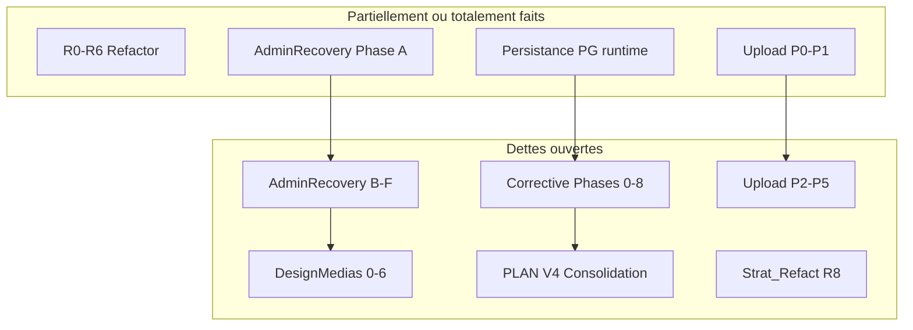
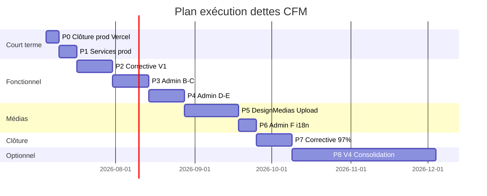

> **[OBSOLETE — 2026-07]** Ce document decrit le modele de persistance Store global + full-sync, remplace par le SQL cible par agregat (voir `docs/adr/0005-sql-par-agregat-sequences.md`).

# Plan d'exécution — Dettes & phases non finalisées CFM ASBL

> **Date** : juillet 2026  
> **Objectif** : couvrir phase par phase tout ce qui n'est pas exécuté à 100 %  
> **Méthode** : croisement des plans existants (`PLAN.md`, `Corrective.md`, `Strat_Refact.md`, `AdminRecovery.md`, `DesignMediasPlan.md`, `UploadAdminPlan.md`) avec l'état réel du code et de la production Vercel + Supabase  
> **Périmètre** : analyse + plan uniquement — **aucune modification de code** dans ce livrable

---

## 1. Synthèse exécutive

### 1.1 Score global estimé (juillet 2026)

| Axe | Score | Commentaire |
|-----|-------|-------------|
| **Produit V1–V3 (fonctionnel)** | ~78 % | Parcours principaux OK ; réserves sur dons réels, emails prod, contenu traduit |
| **Admin enterprise** | ~65 % | Navigation refondée ; CMS, analytics et workflows encore partiels |
| **Médias & design** | ~55 % | Hub admin riche ; photos réelles, identité PWA/OG, QA Lighthouse manquants |
| **Upload admin** | ~73 % | API stabilisée Vercel/Supabase ; PG `media_assets`, E2E Playwright absents |
| **Persistance & infra** | ~85 % | PostgreSQL runtime **récemment corrigé** ; domaine, SMTP, Redis, backups à finaliser |
| **Refactor technique (R0–R6)** | ~95 % | Clean Architecture livrée ; barrels `@deprecated` et dette R8 ouverte |
| **Production « cfmasbl.com »** | ~40 % | Vercel + Supabase OK ; domaine custom, PayDunya prod, validation 97 % non closes |

**Score pondéré global** : **~72 %** — le site est exploitable en production sur `cfm-asbl.vercel.app`, mais les ambitions documentées (97 % Corrective, 100 % AdminRecovery, 100 % DesignMedias) ne sont pas atteintes.

### 1.2 Ce qui a été récemrement bouclé (ne pas replanifier)

| Livrable | Statut |
|----------|--------|
| `PostgresStoreAdapter` + `JsonStoreAdapter` + `getStoreAsync` | ✅ Déployé prod (`a8a0c62`) |
| Invalidation cache admin → site public | ✅ |
| Overrides i18n admin → site public | ✅ |
| Upload Supabase Storage (serverless) | ✅ |
| Tests vitest 70/70 + build 62 routes | ✅ |
| Doc `DEPLOY-VERCEL-SUPABASE.md` section persistance runtime | ✅ |

---

## 2. Cartographie des plans sources

| Document | Phases | Avancement estimé | Référence |
|----------|--------|-------------------|-----------|
| `Corrective.md` | 0 → 8 | ~60 % | 32 modules, cible 97 % |
| `AdminRecovery.md` | A → F | ~55 % | Admin 45 % → 100 % |
| `DesignMediasPlan.md` | 0 → 6 | ~50 % | Médias 25 % → 100 % |
| `UploadAdminPlan.md` | 0 → 5 | 73 % | Score tableau juillet 2026 |
| `Strat_Refact.md` | R0 → R6 | ~98 % | R1.5 constantes partielle |
| `ResultatArchLog.md` | R8 | 0 % | Dette post-Clean Architecture |
| `PLAN.md` | V1–V3 + V4 | V1–V3 code ~90 % ; V4 0 % | Produit |

---

## 3. Matrice des dettes par domaine

### 3.1 Infrastructure & production

| # | Dette | Plan source | État actuel | Cible |
|---|-------|-------------|-------------|-------|
| I1 | Domaine `cfmasbl.com` + DNS | PLAN V4, Corrective §32 | Vercel gratuit uniquement | HTTPS sur domaine ASBL |
| I2 | Emails transactionnels SMTP/Brevo | Corrective §14, Vercel checklist | Log fichier si pas `SMTP_*` | Emails réels en prod |
| I3 | PayDunya / Mobile Money production | PLAN §18, Vercel checklist | `MOBILE_MONEY_MODE=demo` | Première transaction réelle |
| I4 | Rate limit Redis (Upstash) | Corrective §31, Strat R4 | `redis: skipped` sur `/api/health` | Rate limit distribué |
| I5 | Backups PostgreSQL automatiques | Corrective §2.9 | Script `backup-db.sh` présent, cron non vérifié | Sauvegarde quotidienne Supabase |
| I6 | Validation manuelle post-déploiement | DEPLOY-VERCEL-SUPABASE | Checklist documentée, exécution à confirmer | 4 tests prod signés |
| I7 | CI/CD GitHub Actions | PLAN V4 | Workflow retiré (commit historique) | Pipeline typecheck + test + deploy |
| I8 | CDN Cloudflare | UploadAdmin §3.6 | Non configuré | Cache assets `/media` |
| I9 | Monitoring uptime | PLAN V4 | Absent | Alertes downtime |

### 3.2 Persistance & données

| # | Dette | Plan source | État actuel | Cible |
|---|-------|-------------|-------------|-------|
| D1 | Table PG `media_assets` | UploadAdmin §3.3 | Catalog JSON dans `site_settings` | Métadonnées médias normalisées |
| D2 | Migration catalog médias → PG | UploadAdmin §3.4 | Non fait | Script one-shot |
| D3 | Repositories lecture/écriture directe PG (sans Store agrégé) | Corrective Phase 2 follow-up | Store monolithique async | Optimisation scale |
| D4 | Barrels `@deprecated` (`lib/db.ts`, `members.ts`, etc.) | ResultatArchLog R8 | ~30 fichiers deprecated | Imports migrés, barrels retirés |
| D5 | `i18n-supplement.ts` (~800 lignes) | ResultatArchLog R8 | Monolithe TS | JSON consolidés |

### 3.3 Site public & parcours

| # | Dette | Plan source | État actuel | Cible |
|---|-------|-------------|-------------|-------|
| S1 | Contenu pages EN/LN/SW (pas seulement nav) | Corrective §15–16 | Overrides admin + JSON partiels | 80–100 % pages clés |
| S2 | Carte actions RDC (26 provinces) | Corrective §26 | Liste + données, carte visuelle faible | Carte interactive |
| S3 | Espace presse téléchargements | Corrective §24 | PDF statique / admin partiel | Kit presse 100 % pilotable |
| S4 | Transparence donateurs | Corrective §30 | Composant basique | Toggle admin + affichage anonymisé |
| S5 | Performance 3G RDC | PLAN V3/V4 | Non mesurée en conditions réelles | Lighthouse 3G < 5 s LCP |
| S6 | Live temps réel | PLAN V3 reporté | Polling 3 s | WebSocket (V4) |
| S7 | Streaming natif Mux/LiveKit | PLAN V3/V4 | YouTube embed + URL stream | Option pro (V4) |
| S8 | SMS fallback push | PLAN V3/V4 | Non implémenté | Optionnel V4 |

### 3.4 Admin (enterprise)

| # | Dette | Plan source | État actuel | Cible |
|---|-------|-------------|-------------|-------|
| A1 | Graphique activité 7 jours | AdminRecovery A.5 | KPIs seulement, pas de graphique | Widget analytics |
| A2 | Journal récent dans overview | AdminRecovery A.5 / F.5 | `AuditPanel` séparé | 5 dernières actions sur overview |
| A3 | CMS études / campagnes / presse — édition REST dédiée | AdminRecovery B | News via REST ; autres via monolithe `POST /api/admin` | REST uniforme |
| A4 | Toggle publier/dépublier sur tout contenu | AdminRecovery B | Partiel selon entité | 100 % entités |
| A5 | Workflow aide complet (notes, statuts, email membre) | AdminRecovery C.2 | Triage basique | Workflow traçable |
| A6 | Messages contact — liste complète | AdminRecovery C.1 | Data chargée, UX inbox à valider | Liste + marquer lu + export |
| A7 | Newsletter export + recherche | AdminRecovery C.4 | Export partiel via overview | Recherche + CSV |
| A8 | Carte RDC aperçu admin | AdminRecovery C.6 | `TerritoryPanel` basique | Provinces avec/sans actions |
| A9 | Dons réconciliation PayDunya | AdminRecovery D.4 | Lecture + statut manuel | Réconciliation webhook |
| A10 | Live édition complète + replay_url | AdminRecovery E.1/E.6 | Panel V3 fonctionnel | Champs tous éditables |
| A11 | Chat modération bulk | AdminRecovery E.3 | Modération unitaire | Bulk approve/reject |
| A12 | Push — stats abonnés / templates | AdminRecovery E.5 | Envoi manuel | Dashboard push |
| A13 | i18n éditeur avancé (preview, recherche clés) | AdminRecovery F.3 | Éditeur clé par clé | UX enterprise |
| A14 | Exports globaux + rapport PDF mensuel | AdminRecovery F.6 | CSV par entité | Export global + PDF |
| A15 | Tests E2E admin 15 parcours | AdminRecovery F.7 | 0 test Playwright admin | Suite E2E |
| A16 | Déprécier monolithe `POST /api/admin` | AdminRecovery §3.4 Phase C | Encore utilisé (ContentPanel, Inbox) | REST par ressource |

### 3.5 Médias & upload

| # | Dette | Plan source | État actuel | Cible |
|---|-------|-------------|-------------|-------|
| M1 | Photos réelles FIKIN (vs SVG placeholders) | DesignMedias §0.2, Corrective §27 | SVG + fallback `pngToSvg` | ≥ 8 photos réelles |
| M2 | Favicon / OG image admin | DesignMedias §5.3 | Hardcodé `icon.svg` | Upload admin |
| M3 | Panneau « Derniers uploads » | UploadAdmin §5.2 | Absent | 10 derniers + statut |
| M4 | Upload vidéo hero chunked | UploadAdmin §4.3 | Limite 50 Mo seulement | Chunked ou message clair validé |
| M5 | Pre-shrink client (> 5 Mo) | UploadAdmin §4.5 | Non fait | Optionnel |
| M6 | E2E Playwright upload → homepage | UploadAdmin §5.4 | Absent | 1 scénario automatisé |
| M7 | Audit Lighthouse + WCAG alt | DesignMedias §6.4–6.5 | Non exécuté | LCP < 2,5 s ; 100 % alt |
| M8 | Matrice alt text FR (CSV) | DesignMedias §0.4 | Non documentée | CSV assets seed |

---

## 4. Plan d'exécution par phases

> **Ordre recommandé** : stabiliser la production et la confiance admin/site **avant** les optimisations (WebSocket, Mux, app native).

### Phase P0 — Clôture production Vercel (3–5 jours)

**Objectif** : confirmer que le correctif persistance tient en conditions réelles.

| # | Tâche | Livrables | Critères |
|---|-------|-----------|----------|
| P0.1 | Exécuter checklist `DEPLOY-VERCEL-SUPABASE.md` | Rapport signé | 4 points validation OK |
| P0.2 | Test E2E manuel admin → site (actu, hero, membre, pétition) | Capture + ligne `news` Supabase | < 30 s sur homepage |
| P0.3 | Vérifier persistance après cold start lambda | 2e session admin | Données intactes |
| P0.4 | Documenter mot de passe admin prod (hors Git) | Runbook interne | Accès fondateur sécurisé |
| P0.5 | Configurer `NEXT_PUBLIC_SITE_URL` = URL stable prod | Vercel env | Liens reset password OK |

**Dettes couvertes** : I6  
**Score après phase** : infra ~88 %

---

### Phase P1 — Services production manquants (1 semaine)

**Objectif** : sortir du mode « démo » sur les flux critiques communauté.

| # | Tâche | Livrables | Critères |
|---|-------|-----------|----------|
| P1.1 | Configurer SMTP (Brevo/Resend) sur Vercel | `SMTP_*` + test envoi | Email inscription reçu |
| P1.2 | Activer PayDunya prod (`MOBILE_MONEY_MODE=production`) | Variables `PAYDUNYA_*` | 1 don test sandbox puis prod |
| P1.3 | Configurer Upstash Redis | `UPSTASH_*` | `/api/health` → `redis: ok` |
| P1.4 | Planifier backup Supabase (Dashboard ou `backup-db.sh`) | Cron documenté | 1 backup restaurable testé |
| P1.5 | Option `CFM_REQUIRE_SMTP=true` en prod | Env Vercel | Pas d'email silencieux en log |

**Dettes couvertes** : I2, I3, I4, I5  
**Score après phase** : produit V2 ~85 %

---

### Phase P2 — Corrective : parcours & contenu V1 (1–2 semaines)

**Objectif** : fermer les modules Corrective encore < 80 %.

| # | Tâche | Réf. Corrective | Critères |
|---|-------|-----------------|----------|
| P2.1 | Valider smoke toutes URLs publiques | Phase 0 | `npm run smoke` vert |
| P2.2 | Pétitions : i18n formulaire + 2ᵉ seed + liens campagnes | Phase 1 | Parcours LN/SW sur détail |
| P2.3 | Live : seed FIKIN replay/embed + compteur viewers | Phase 1 | Player non vide |
| P2.4 | Fallback médias client (plus de 404 console) | Phase 1 | Actions + accueil propres |
| P2.5 | Presse : kit PDF pilotable admin → `/presse` | Phase 3 | Téléchargement OK |
| P2.6 | Carte / territoire actions améliorée | Phase 3 | 26 provinces visibles |
| P2.7 | Pages détail actualités — SEO + cover | Phase 3 / §29 | Slug OK, image cover |
| P2.8 | Transparence donateurs (toggle admin) | Phase 3 / §30 | Affichage public cohérent |

**Dettes couvertes** : S3, S4, partie Corrective 0–3  
**Score après phase** : Corrective ~75 %

---

### Phase P3 — AdminRecovery B–C : CMS & opérations (2 semaines)

**Objectif** : admin autonome sur contenu et triage sans toucher au code.

| # | Tâche | Réf. AdminRecovery | Critères |
|---|-------|-------------------|----------|
| P3.1 | Uniformiser édition contenu via REST (études, campagnes, presse) | B.1–B.5 | Zéro `action=update_content` pour CRUD standard |
| P3.2 | Toggle publier/dépublier toutes entités | B | Visible site < 5 min |
| P3.3 | Inbox contact + aide workflow complet | C.1–C.2 | Notes internes + email membre |
| P3.4 | Adhésions rejeter + export | C.3 | CSV adhésions |
| P3.5 | Newsletter recherche + export | C.4 | Filtre email |
| P3.6 | TerritoryPanel carte provinces | C.6 | Lien visuel `/actions` |

**Dettes couvertes** : A3–A8, A16 (partiel)  
**Score après phase** : admin ~75 %

---

### Phase P4 — AdminRecovery D–E : communauté & live (1–2 semaines)

| # | Tâche | Critères |
|---|-------|----------|
| P4.1 | Membres : suspendre, rôle, export | PATCH users complet |
| P4.2 | Liens familiaux : rejeter + historique | Endpoint reject |
| P4.3 | Pétitions : édition, désactivation, export signatures | Admin sans monolithe |
| P4.4 | Dons : réconciliation PayDunya + reçu email | Statut `completed` via webhook |
| P4.5 | Live : édition tous champs + replay_url | Plus de replay hardcodé |
| P4.6 | Chat modération bulk + badge pending par event | E.2, E.3 |
| P4.7 | Sondages : fermer, exporter votes | E.4 |
| P4.8 | Push : liste abonnés + stats | E.5 |

**Dettes couvertes** : A9–A12  
**Score après phase** : admin ~85 %

---

### Phase P5 — DesignMedias + Upload (2–3 semaines)

**Objectif** : médias 25 % → 90 %+.

| # | Tâche | Réf. | Critères |
|---|-------|------|----------|
| P5.1 | Import photos réelles (`assets/incoming/` → Supabase) | DM §0.2 | `/a-propos` photos réelles |
| P5.2 | Matrice alt CSV + saisie admin | DM §0.4 | 100 % alt non vides |
| P5.3 | Favicon + OG upload | DM §5.3 | Meta partage social |
| P5.4 | Panneau derniers uploads | Upload §5.2 | 10 entrées |
| P5.5 | Table `media_assets` + migration (optionnel si scale) | Upload §3.3–3.4 | PG métadonnées |
| P5.6 | E2E Playwright : upload hero → `/` | Upload §5.4 | CI vert |
| P5.7 | Lighthouse accueil + WCAG | DM §6.4–6.5 | LCP < 2,5 s |

**Dettes couvertes** : M1–M8, D1–D2 (optionnel)  
**Score après phase** : médias ~90 %

---

### Phase P6 — AdminRecovery F + i18n (1 semaine)

| # | Tâche | Critères |
|---|-------|----------|
| P6.1 | Overview : graphique 7 j + journal récent | A.5 |
| P6.2 | i18n : recherche clés + preview page | F.3 |
| P6.3 | Constantes site (tagline, emails) via settings | F.4 |
| P6.4 | Audit log filtres date/action | F.5 |
| P6.5 | Export global CSV + rapport PDF mensuel | F.6 |
| P6.6 | Tests E2E admin 15 parcours | F.7 |
| P6.7 | `docs/admin-runbook.md` fondateur | F.8 |

**Dettes couvertes** : A1–A2, A13–A15  
**Score après phase** : admin ~95 %

---

### Phase P7 — Corrective clôture 97 % (1–2 semaines)

| # | Tâche | Réf. Corrective | Critères |
|---|-------|-----------------|----------|
| P7.1 | i18n contenu EN/LN/SW pages clés | §15–16 | 80 %+ contenu (pas nav seule) |
| P7.2 | PWA : install + cache hors-ligne partiel | §21 | Android + desktop |
| P7.3 | Push prod HTTPS : 1 campagne test | §20 | Abonnement + réception |
| P7.4 | Rate limit + CSP renforcée | Phase 7 | Audit sécurité |
| P7.5 | Re-audit 32 modules Corrective | Phase 8 | ≥ 97 % documenté |

**Dettes couvertes** : S1, Corrective 4–8  
**Score cible** : **≥ 97 %** Corrective

---

### Phase P8 — Consolidation V4 (optionnel, 4–8 semaines)

**Objectif** : `PLAN.md` §21 — hors urgence si Vercel+Supabase suffit.

| # | Tâche | Critères |
|---|-------|----------|
| P8.1 | Domaine `cfmasbl.com` + DNS Vercel | I1 |
| P8.2 | WebSocket chat live (Socket.io / Pusher) | S6 |
| P8.3 | Mux ou LiveKit streaming | S7 |
| P8.4 | CI/CD GitHub → Vercel | I7 |
| P8.4 | CDN Cloudflare | I8 |
| P8.5 | Monitoring uptime | I9 |
| P8.6 | Dette R8 : retirer barrels deprecated, ESLint couches | D4–D5 |
| P8.7 | Repositories PG directs (optimisation) | D3 |

---

## 5. Calendrier indicatif

| Phase | Durée | Priorité | Bloquant métier |
|-------|-------|----------|-----------------|
| P0 | 3–5 j | **P0** | Oui — confiance prod |
| P1 | 1 sem | **P0** | Oui — dons & emails réels |
| P2 | 1–2 sem | P1 | Contenu public complet |
| P3–P4 | 3–4 sem | P1 | Admin autonome |
| P5–P6 | 3–4 sem | P2 | Médias & gouvernance |
| P7 | 1–2 sem | P1 | Cible 97 % |
| P8 | 2+ mois | P3 | Évolution plateforme |

**Durée totale P0–P7** : ~10–14 semaines (1 dev, rythme soutenu)

---

## 6. Questions pour aligner votre logique

Répondez à ces questions pour prioriser et ajuster le plan. Vos réponses permettront de réordonner P1–P8.

### 6.1 Vision produit & délais

1. **Horizon** : visez-vous la clôture **97 % Corrective** (P0–P7, ~3 mois) ou un **MVP opérationnel** (P0–P1 seulement, ~2 semaines) avant tout le reste ?

2. **Utilisateur admin** : confirmez-vous toujours **1 fondateur seul** au quotidien (AdminRecovery) — ou prévoyez-vous des bénévoles actifs sous 3 mois ?

3. **Deadline externe** : existe-t-il un événement fixe (FIKIN, campagne, AG) qui impose une date de livraison ?

### 6.2 Hébergement & budget

4. **Vercel + Supabase** : souhaitez-vous **rester sur cette stack** (recommandé après correctif PG) ou **migrer vers VPS** (`DEPLOY-VPS.md`) comme prévu initialement dans PLAN V4 ?

5. **Domaine** : `cfmasbl.com` est-il déjà acheté ? Souhaitez-vous le brancher en **P1** ou attendre P8 ?

6. **Budget infra** : êtes-vous prêt à activer **Supabase Pro**, **Brevo payant**, **Upstash**, et **PayDunya** (commissions) en 2026, ou tout doit rester en free tier ?

### 6.3 Fonctionnel métier

7. **Dons** : la priorité est-elle **Mobile Money réel** (P1) ou le mode démo suffit encore pour des mois ?

8. **Emails** : quels flux sont **critiques** en premier ? (inscription membre, reset password, réponse aide, reçu don, activation compte)

9. **Live** : le **polling 3 s** vous convient-il pour 2026, ou le **WebSocket** (P8) est indispensable pour un prochain événement live ?

10. **Langues** : pour LN/SW, voulez-vous une **traduction technique** (admin overrides) ou une **validation par locuteurs natifs** avant publication ?

### 6.4 Médias & contenu

11. **Photos réelles** : disposez-vous déjà d'un dossier `assets/incoming/` prêt à importer, ou faut-il prévoir une **collecte terrain** (Phase 0 DesignMedias) ?

12. **Vidéo hero** : préférez-vous **YouTube uniquement** (recommandé UploadAdmin D5) ou héberger un **MP4 sur Supabase** malgré la limite 50 Mo ?

13. **Médias admin** : l'objectif est-il **100 % sans toucher au code** (votre vision AdminRecovery) ou acceptez-vous des **ajouts CLI** (`import-media`) pour aller plus vite ?

### 6.5 Technique & qualité

14. **Monolithe admin** : souhaitez-vous **migrer tout vers REST** (P3) avant nouvelles features, ou garder `POST /api/admin` tant que ça fonctionne ?

15. **Tests** : quelle couverture visez-vous ? (vitest seul OK / + Playwright E2E admin / + audit Lighthouse CI)

16. **Dette R8** (barrels deprecated, `i18n-supplement.ts`) : **nettoyage maintenant** (P8) ou **après** livraison fonctionnelle ?

### 6.6 Sécurité & conformité

17. **Données sensibles** : le chiffrement `help_requests` est-il suffisant, ou faut-il un **audit RGPD** formel (export/effacement membre) ?

18. **Secrets** : souhaitez-vous **régénérer** les clés Supabase/Vercel partagées en chat précédent ?

---

## 7. Prochaine action recommandée

1. **Répondre aux questions §6** (même partiellement — priorisez 4, 5, 7, 11).
2. **Exécuter P0** si pas encore fait : test manuel actu admin → homepage prod.
3. **Décider P1 vs P2** selon votre réponse sur dons/emails.

---

## 8. Références

| Document | Rôle |
|----------|------|
| [`Corrective.md`](Corrective.md) | 32 modules, phases 0–8, cible 97 % |
| [`AdminRecovery.md`](AdminRecovery.md) | Admin enterprise phases A–F |
| [`DesignMediasPlan.md`](DesignMediasPlan.md) | Hub médias 0–6 |
| [`UploadAdminPlan.md`](UploadAdminPlan.md) | Upload score 73 % |
| [`Strat_Refact.md`](Strat_Refact.md) | Refactor R0–R6 |
| [`ResultatArchLog.md`](ResultatArchLog.md) | Dette R8 |
| [`PLAN.md`](PLAN.md) | V1–V4 produit |
| [`docs/DEPLOY-VERCEL-SUPABASE.md`](docs/DEPLOY-VERCEL-SUPABASE.md) | Prod actuelle |

---

*Document généré par analyse globale code + plans — juillet 2026. À mettre à jour après vos réponses §6.*
