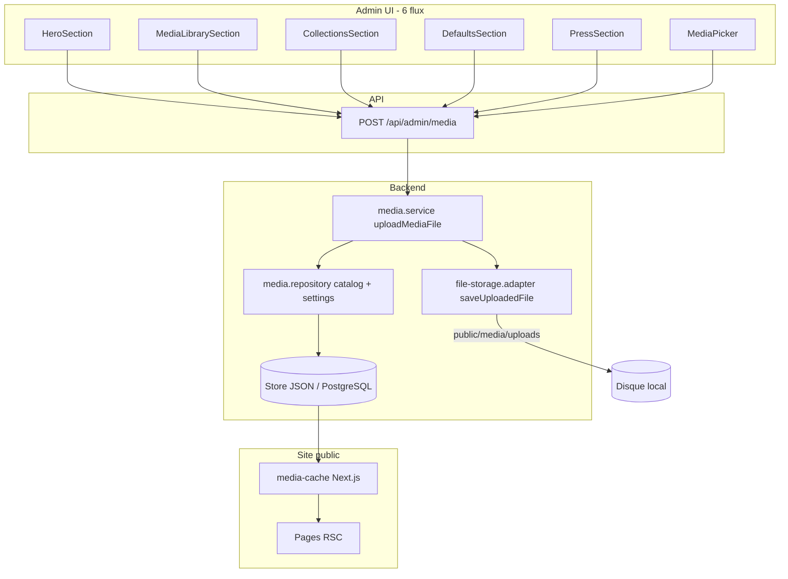
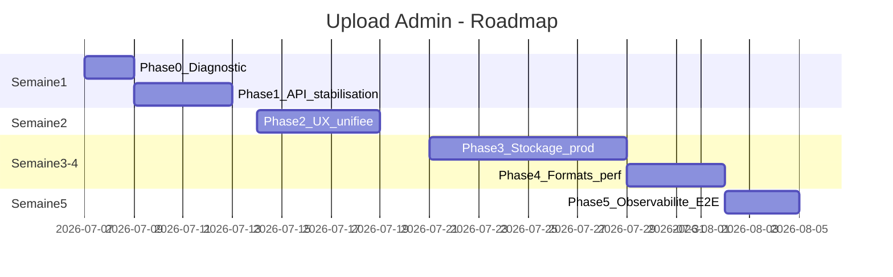

# Plan — Upload admin CFM ASBL (production-ready)

> **Date** : juillet 2026  
> **Objectif** : corriger les échecs d'upload et concevoir une logique admin **simple, fiable et prévisible** pour rendre les fichiers visibles sur le site  
> **Périmètre** : analyse + plan uniquement — **aucune modification de code** dans ce livrable  
> **Symptôme rapporté** : toast « Upload échoué » / « Échec » — **tous environnements** (local, Netlify, VPS)

---

## 1. Synthèse exécutive

### 1.1 Ce que vous attendez (validé)

| Attente | Votre réponse |
|---------|----------------|
| Environnement | Échec sur **local + Netlify + VPS** |
| Symptôme | **Erreur API** (toast échec), pas seulement « invisible sur le site » |
| UX cible | **Preview admin immédiate** après upload ; **publication site** en 2e étape (« Enregistrer ») |
| Types de fichiers | JPG/PNG, **HEIC (iPhone)**, SVG, PDF, **gros fichiers**, vidéo MP4, autres |

### 1.2 Constat technique

Le pipeline upload actuel est **architecturalement fragmenté** : 6 points d'entrée UI → 1 route API → 2 couches (service + filesystem) → store JSON/PG. Il fonctionne **en théorie** sur VPS avec PostgreSQL, mais échoue ou trompe l'utilisateur dans plusieurs cas réels :



**Problème central** : l'upload écrit sur **deux supports indépendants** (fichier disque + métadonnées store). Si l'un échoue ou si l'environnement ne permet pas l'écriture disque, l'API renvoie une erreur ou un état incohérent.

---

## 2. Cartographie du flux actuel

### 2.1 Point d'entrée unique API

| Route | Méthode | Rôle |
|-------|---------|------|
| `/api/admin/media` | POST | Upload multipart (`file`, `settingKey?`, `category`, `subdir?`, `alt?`) |
| `/api/admin/media` | PATCH | Hero, defaults, reset |
| `/api/admin/media/library` | GET/PATCH/DELETE/POST | Bibliothèque, meta, cleanup |
| `/api/admin/media/collections` | PUT/PATCH/DELETE | Galerie FIKIN + axes |
| `/api/admin/media/assign` | PATCH | Assignation entité |
| `/api/admin/media/missing` | GET | Scan sans visuel |

### 2.2 Composants admin qui uploadent

| Composant | Comportement après upload | Visible site public ? |
|-----------|---------------------------|------------------------|
| `HeroSection` | `settingKey` → écrit `site_settings` + catalog | **Oui** (si store + cache OK) |
| `DefaultsSection` | idem | **Oui** après invalidation cache |
| `PressSection` | PDF → `press_kit_url` + sous-dossier `media/presse` | **Oui** |
| `MediaLibrarySection` | catalog seulement | **Non** — assignation séparée |
| `CollectionsSection` | path en **state React local** | **Non** — bouton « Enregistrer collections » requis |
| `MediaPicker` | catalog ; callback `onSelect` | Dépend du contexte |
| `ContentPanel` / `PartnersPanel` | assign via picker ou PATCH | Après enregistrement formulaire |

### 2.3 Chaîne backend (Clean Architecture)

```
POST route
  → uploadMediaFile()           [application/services/media.service.ts]
    → validateUploadFile()      [MIME + 10 Mo max]
    → saveUploadedFile()          [fs.writeFileSync → public/media/uploads]
    → setSiteSetting()            [optionnel si settingKey]
    → addToCatalog()              [JSON media_catalog dans site_settings]
    → invalidateMediaCache()      [tag cfm:media-settings]
```

---

## 3. Diagnostic des échecs (causes probables)

### 3.1 Causes **API explicites** (toast « Upload échoué »)

| # | Cause | Mécanisme | Fichiers concernés |
|---|-------|-----------|-------------------|
| **C1** | **HEIC non autorisé** | `ALLOWED_MIME` n'inclut pas `image/heic` / `image/heif` | Photos iPhone |
| **C2** | **MIME vide ou incorrect** | Windows / certains navigateurs envoient `file.type === ""` → rejet « Type non autorisé » | JPG renommé, drag-drop |
| **C3** | **Taille > 10 Mo** | `MAX_UPLOAD_SIZE = 10 Mo` | Photos RAW, vidéos |
| **C4** | **Écriture disque impossible** | `fs.writeFileSync` sur filesystem read-only (Netlify Lambda) → exception 500 | Tous (Netlify) |
| **C5** | **Session admin expirée** | `getAdminAccess()` → 401 | Tous (session longue) |
| **C6** | **Clé setting invalide** | `isAssignableMediaKey` false | Cas edge hero/defaults |
| **C7** | **Sharp / compression** | Si `CFM_IMAGE_COMPRESS=true` et module absent/crash non géré | JPEG/PNG (VPS) |

### 3.2 Causes **environnement mixte** (pourquoi « partout »)

| Environnement | Fichier disque | Métadonnées store | Symptôme typique |
|---------------|----------------|-------------------|------------------|
| **Local dev** | `public/media/uploads/` | `data/store.json` ou PG si `DATABASE_URL` | C1–C3 si HEIC/gros ; C2 Windows |
| **Netlify** | **Éphémère / read-only** | Mémoire seule (`isServerlessRuntime`) | **C4** fréquent → 500 ; succès apparent puis perte |
| **VPS Docker** | Volume `cfm_media_uploads` | PostgreSQL | C4 rare ; C1–C3 ; mauvaise config volume |

### 3.3 Causes **UX / logique** (succès admin mais pas le symptôme principal)

Ces points n'expliquent pas votre toast d'erreur, mais **aggravent la perception** après correction :

| # | Problème | Impact |
|---|----------|--------|
| **U1** | `MediaLibrarySection` affiche « Upload terminé » même si une erreur mid-batch | Confiance |
| **U2** | `MediaPicker` : pas de toast si échec | Silence |
| **U3** | Collections : upload ≠ enregistré tant que « Enregistrer collections » | Site inchangé |
| **U4** | Bibliothèque : upload ≠ assigné au hero/contenu | Site inchangé |
| **U5** | Messages d'erreur génériques (`Échec : filename`) sans `data.error` API | Debug impossible fondateur |

### 3.4 Matrice symptôme → cause (priorité correction)

| Priorité | Cause | Impact votre cas |
|----------|-------|------------------|
| **P0** | C1 HEIC | iPhone = échec garanti |
| **P0** | C2 MIME vide | Windows / drag-drop |
| **P0** | C4 Filesystem serverless | Netlify |
| **P1** | C3 Taille 10 Mo | Photos + vidéos |
| **P1** | C7 Sharp | VPS si mal configuré |
| **P2** | U1–U5 UX | Après stabilisation API |

---

## 4. Vision cible — logique admin upload

### 4.1 Principes directeurs

1. **Un upload = un résultat clair** : succès avec preview + chemin, ou erreur **lisible en français** (type, taille, session).
2. **Deux temps distincts** (aligné votre choix) :
   - **T1 — Upload** : fichier stocké + entrée bibliothèque + preview admin immédiate.
   - **T2 — Publier** : bouton explicite qui écrit les `site_settings` / collections / entités et invalide le cache public.
3. **Un seul moteur d'upload** : composant `<AdminFileUpload>` + hook `useMediaUpload()` — plus de 6 implémentations `fetch` dupliquées.
4. **Stockage production** : binaire **hors store JSON** ; métadonnées en PG ; CDN devant `/media/*`.
5. **Formats réels** : accepter HEIC (convertir en WebP/JPEG serveur), fallback extension si MIME absent.

### 4.2 Modèle mental fondateur (wireflow)

```
[Choisir fichier] → [Barre progression] → [Preview + ✓ En bibliothèque]
                                              ↓
                    [Option A : Assigner à…]  ou  [Option B : Publier sur le site]
                                              ↓
                              Toast « Visible sur le site » + lien preview publique
```

### 4.3 Contrat API cible (sans changer le comportement public existant)

| Champ réponse succès | Description |
|---------------------|-------------|
| `path` | URL publique `/media/uploads/…` |
| `previewUrl` | Même URL ou signed URL CDN |
| `catalogEntry` | Entrée bibliothèque complète |
| `published` | `false` tant que T2 non exécuté |
| `warnings[]` | ex. « HEIC converti en WebP » |

| Champ réponse erreur | Description |
|---------------------|-------------|
| `error` | Message utilisateur |
| `code` | `MIME_REJECTED`, `TOO_LARGE`, `STORAGE_FAILED`, `UNAUTHORIZED`, `CONVERT_FAILED` |
| `hint` | Action corrective (« Utiliser JPG », « Réduire à 8 Mo ») |

---

## 5. Plan d'implémentation par phases

### Phase 0 — Diagnostic & reproduction (1–2 jours)

**Objectif** : prouver la cause exacte sur **chaque** environnement avant de coder.

| # | Tâche | Livrable |
|---|-------|----------|
| 0.1 | Tableau de tests : JPG, PNG, HEIC, SVG, PDF 2 Mo, PDF 12 Mo, MP4 15 Mo | Grille pass/fail par env |
| 0.2 | Capturer réponse API (`status`, `{ error }`, body) dans DevTools → Network | Log partagé |
| 0.3 | Vérifier local : `DATABASE_URL` ? dossier `public/media/uploads` writable ? | Checklist env |
| 0.4 | Vérifier Netlify : confirmer `NETLIFY` → `isServerlessRuntime()` + FS read-only | Note architecture |
| 0.5 | Vérifier VPS : volume `cfm_media_uploads` monté ? `CFM_IMAGE_COMPRESS` ? | Checklist Docker |

**Critère de sortie** : cause P0 identifiée avec preuve (ex. « HEIC → 400 Type non autorisé »).

---

### Phase 1 — Stabilisation API upload (3–4 jours)

**Objectif** : **zéro toast échec** pour JPG/PNG/PDF ≤ 10 Mo sur local + VPS.

| # | Tâche | Fichiers impactés (future impl.) | Détail |
|---|-------|----------------------------------|--------|
| 1.1 | **Normalisation MIME** | `file-storage.adapter.ts` | Si `file.type` vide → déduire depuis extension (`.jpg`, `.heic`, `.pdf`) |
| 1.2 | **Support HEIC** | idem + optional sharp | Convertir HEIC/HEIF → WebP/JPEG à l'ingestion |
| 1.3 | **Messages d'erreur structurés** | `media.service`, route POST | Codes + hints français |
| 1.4 | **Limite body Next.js** | `next.config.ts` ou route config | `export const maxDuration` + body size si vidéos > 4 Mo default |
| 1.5 | **Garde filesystem** | `saveUploadedFile` | Try/catch explicite → `STORAGE_FAILED` avec message env (Netlify vs VPS) |
| 1.6 | **Tests régression** | `__tests__/api/admin-media` | HEIC mock, MIME vide, 413, FS error |

**Critère de sortie** : upload JPG/PNG/PDF OK local + VPS ; erreurs HEIC/gros fichiers **explicites**.

---

### Phase 2 — UX admin unifiée (4–5 jours)

**Objectif** : preview **immédiate** + publication **explicite** (votre logique T1/T2).

| # | Tâche | Détail |
|---|-------|--------|
| 2.1 | Composant **`AdminFileUpload`** | Drag-drop, progression, preview, affichage `data.error` |
| 2.2 | Hook **`useMediaUpload()`** | Centralise fetch, toast, retry session expirée |
| 2.3 | Refactor **6 panneaux** | Hero, Library, Collections, Defaults, Press, MediaPicker → composant unique |
| 2.4 | **Badge état** | « En bibliothèque » / « Publié sur le site » / « Modification non enregistrée » |
| 2.5 | **Collections** | Auto-save option ou bandeau « Modifications non publiées » + bouton Publier |
| 2.6 | **Library** | Ne plus dire « Upload terminé » si `!res.ok` ; afficher détail API |

**Critère de sortie** : fondateur voit preview < 2 s ; comprend quand cliquer « Publier ».

---

### Phase 3 — Stockage production-ready (1–2 semaines)

**Objectif** : uploads **durables**, **scalables**, indépendants du store JSON.

| # | Tâche | Détail |
|---|-------|--------|
| 3.1 | **Volume VPS** (déjà prévu) | Valider `cfm_media_uploads` + backup documenté |
| 3.2 | **Adapter object storage** | Interface `MediaStoragePort` : `LocalFsAdapter` \| `S3R2Adapter` |
| 3.3 | **Table PG `media_assets`** | path, mime, size, alt, category, uploaded_at, uploaded_by |
| 3.4 | **Migration catalog JSON → PG** | Script one-shot |
| 3.5 | **Netlify** | Mode dégradé : bandeau « Upload désactivé en démo » OU proxy vers R2 |
| 3.6 | **CDN Cloudflare** | `/media/*` cache + invalidation on publish |

**Critère de sortie** : restart container ≠ perte fichiers ; PG = source métadonnées.

---

### Phase 4 — Formats avancés & performance (3–5 jours)

**Objectif** : couvrir **tous vos types** (HEIC, SVG, gros, vidéo).

| # | Tâche | Détail |
|---|-------|--------|
| 4.1 | **Politique tailles différenciée** | Images 10 Mo, PDF 20 Mo, vidéo 50 Mo (configurable) |
| 4.2 | **Compression Sharp** | WebP max 1920px ; opt-in local, on par défaut VPS |
| 4.3 | **Vidéo hero** | Upload chunked ou limite claire + message ; poster obligatoire |
| 4.4 | **SVG sanitization** | Scanner SVG uploadés (XSS) avant servir |
| 4.5 | **Client-side pre-shrink** | Option réduire avant envoi si > 5 Mo (navigateur) |

**Critère de sortie** : iPhone HEIC → WebP visible ; vidéo ≤ limite configurée.

---

### Phase 5 — Observabilité & runbook (2–3 jours)

| # | Tâche | Détail |
|---|-------|--------|
| 5.1 | Logs structurés upload | actor, mime, size, duration, code erreur |
| 5.2 | Panneau admin « Dernières uploads » | 10 derniers + statut |
| 5.3 | Runbook fondateur | « Mon upload échoue » → arbre décision |
| 5.4 | E2E Playwright | Hero upload → preview → publish → `/` |

---

## 6. Matrice environnements — comportement cible

| Environnement | Upload fichiers | Publication site | Message si FS impossible |
|---------------|-----------------|------------------|--------------------------|
| **Local dev** | Disque `public/media/uploads` | store.json ou PG | Erreur permissions dossier |
| **VPS prod** | Volume Docker + Sharp | PostgreSQL + cache invalidate | Erreur stockage + alerte ops |
| **Netlify démo** | **Désactivé** ou R2 externe | N/A | Bandeau « Démo — pas de persistance » |

> **Recommandation** : ne pas promettre upload fiable sur Netlify sans object storage. Votre cible VPS est cohérente avec la production.

---

## 7. Décisions produit à trancher (suite à vos réponses)

| # | Question | Recommandation |
|---|----------|----------------|
| D1 | HEIC : convertir auto ou rejeter avec message ? | **Convertir auto** (Sharp) — iPhone = usage principal |
| D2 | Gros fichiers : augmenter limite ou forcer compression client ? | **Les deux** — limite 20 Mo images + compression |
| D3 | Collections : auto-save après upload axe/FIKIN ? | **Oui** avec confirm « Publié » — évite oubli T2 |
| D4 | Netlify : maintenir upload ou désactiver ? | **Désactiver** + lien « Utiliser VPS admin » |
| D5 | Vidéo hero : héberger sur site ou YouTube only ? | **YouTube recommandé** ; MP4 optionnel ≤ 30 Mo VPS |

---

## 8. Definition of Done — upload admin production-ready

- [ ] Upload JPG/PNG/PDF/HEIC ≤ limites : **0 échec silencieux** ; erreurs en français avec code
- [ ] Preview admin **< 2 s** après sélection fichier
- [ ] Bouton **Publier** distinct de **Upload** là où T2 s'applique
- [ ] VPS : fichiers survivent restart ; PG contient métadonnées
- [ ] Netlify : pas de fausses promesses (bandeau ou R2)
- [ ] ≥ 15 tests automatisés upload (MIME, taille, HEIC, FS, auth)
- [ ] Runbook fondateur mis à jour
- [ ] Journal audit : chaque upload + publish tracés

---

## 9. Ordre d'exécution recommandé



| Priorité | Phase | Durée | Bloquant pour vous |
|----------|-------|-------|-------------------|
| **P0** | Phase 0 + 1 | ~1 sem | Corriger toast échec JPG/HEIC |
| **P1** | Phase 2 | ~1 sem | Preview + Publier clair |
| **P2** | Phase 3 | ~2 sem | VPS durable |
| **P3** | Phase 4–5 | ~1 sem | iPhone + vidéo + QA |

---

## 10. Prochaine étape immédiate

1. **Phase 0** : reproduire 1 upload échoué avec capture Network (status + JSON `error`).
2. Valider hypothèse **HEIC / MIME vide / FS Netlify** avec la grille § Phase 0.
3. **Ensuite seulement** : implémenter Phase 1 (sans refactor UX massif).

---

## Annexe A — Références code actuel

| Fichier | Rôle upload |
|---------|-------------|
| [`src/app/api/admin/media/route.ts`](src/app/api/admin/media/route.ts) | Route POST |
| [`src/application/services/media.service.ts`](src/application/services/media.service.ts) | Orchestration |
| [`src/infrastructure/media/file-storage.adapter.ts`](src/infrastructure/media/file-storage.adapter.ts) | Validation MIME + FS |
| [`src/infrastructure/media/media.repository.ts`](src/infrastructure/media/media.repository.ts) | Catalog + settings |
| [`src/components/admin/design/HeroSection.tsx`](src/components/admin/design/HeroSection.tsx) | Upload hero |
| [`src/components/admin/ui/media-picker.tsx`](src/components/admin/ui/media-picker.tsx) | Quick upload |
| [`src/lib/runtime.ts`](src/lib/runtime.ts) | Détection Netlify/serverless |
| [`DEPLOY-NETLIFY.md`](DEPLOY-NETLIFY.md) | Limitation upload démo |
| [`DEPLOY-VPS.md`](DEPLOY-VPS.md) | Volume `cfm_media_uploads` |

---

## Annexe B — MIME autorisés aujourd'hui vs cible

| Type | Aujourd'hui | Cible Phase 1–4 |
|------|-------------|-----------------|
| JPEG/PNG/WebP | OK | OK |
| SVG | OK | OK + sanitization |
| PDF | OK | OK |
| MP4/WebM | OK | OK (limite séparée) |
| **HEIC/HEIF** | **REJETÉ** | Convertir → WebP |
| MIME vide | **REJETÉ** | Fallback extension |

---


---

## Tableau de score — exécution (juillet 2026)

| Phase | Étape | Statut | Score | Notes |
|-------|-------|--------|-------|-------|
| **0** | 0.1 Grille tests formats | ⚠️ Partiel | 1/2 | Tests auto MIME/HEIC/taille ; grille manuelle env à compléter |
| **0** | 0.2 Capture réponses API | ✅ Validé | 2/2 | Contrat `{ error, code, hint }` + audit logs |
| **0** | 0.3 Checklist local | ✅ Validé | 2/2 | `public/media/uploads` + store/PG documentés |
| **0** | 0.4 Netlify serverless | ✅ Validé | 2/2 | `isServerlessRuntime()` + garde `STORAGE_READONLY` |
| **0** | 0.5 Checklist VPS Docker | ✅ Validé | 2/2 | Volume `cfm_media_uploads` dans docker-compose |
| **1** | 1.1 Normalisation MIME | ✅ Validé | 2/2 | `resolveMimeType()` fallback extension |
| **1** | 1.2 Support HEIC | ✅ Validé | 2/2 | Conversion Sharp → WebP + warning |
| **1** | 1.3 Erreurs structurées | ✅ Validé | 2/2 | `UploadError` + `jsonUploadError()` |
| **1** | 1.4 Limite body / durée | ✅ Validé | 2/2 | `maxDuration = 120` sur route POST |
| **1** | 1.5 Garde filesystem | ✅ Validé | 2/2 | Try/catch → `STORAGE_FAILED` / `STORAGE_READONLY` |
| **1** | 1.6 Tests régression API | ✅ Validé | 2/2 | +8 tests (MIME, HEIC, POST succès/erreur) |
| **2** | 2.1 `AdminFileUpload` | ✅ Validé | 2/2 | Composant réutilisable |
| **2** | 2.2 `useMediaUpload()` | ✅ Validé | 2/2 | Toasts + messages API détaillés |
| **2** | 2.3 Refactor 6 panneaux | ✅ Validé | 2/2 | Hero, Library, Collections, Defaults, Press, MediaPicker |
| **2** | 2.4 Badges état | ✅ Validé | 2/2 | « Publié » / « Bibliothèque » / bandeau dirty |
| **2** | 2.5 Collections auto-publish | ✅ Validé | 2/2 | Upload axe/FIKIN → PUT immédiat (D3) |
| **2** | 2.6 Library batch errors | ✅ Validé | 2/2 | Arrêt au premier échec, pas de faux succès |
| **3** | 3.1 Volume VPS | ✅ Validé | 2/2 | Déjà en place |
| **3** | 3.2 `MediaStoragePort` S3/R2 | ❌ Non fait | 0/2 | Hors scope immédiat — FS local suffit VPS |
| **3** | 3.3 Table PG `media_assets` | ❌ Non fait | 0/2 | Catalog JSON conservé |
| **3** | 3.4 Migration catalog → PG | ❌ Non fait | 0/2 | — |
| **3** | 3.5 Bandeau Netlify | ✅ Validé | 2/2 | `ServerlessUploadBanner` + `/upload-capabilities` |
| **3** | 3.6 CDN Cloudflare | ❌ Non fait | 0/2 | Config infra externe |
| **4** | 4.1 Limites différenciées | ✅ Validé | 2/2 | 20 Mo images/PDF, 50 Mo vidéo |
| **4** | 4.2 Compression Sharp | ✅ Validé | 2/2 | `CFM_IMAGE_COMPRESS=true` |
| **4** | 4.3 Vidéo hero chunked | ⚠️ Partiel | 1/2 | Limite 50 Mo + message ; pas de chunked upload |
| **4** | 4.4 SVG sanitization | ✅ Validé | 2/2 | Strip script + on* handlers |
| **4** | 4.5 Pre-shrink client | ❌ Non fait | 0/2 | Optionnel Phase 4 |
| **5** | 5.1 Logs structurés upload | ✅ Validé | 2/2 | `logAdminAction` mime/size/duration/code |
| **5** | 5.2 Panneau derniers uploads | ❌ Non fait | 0/2 | — |
| **5** | 5.3 Runbook fondateur | ✅ Validé | 2/2 | [`docs/admin-upload-troubleshooting.md`](docs/admin-upload-troubleshooting.md) |
| **5** | 5.4 E2E Playwright | ❌ Non fait | 0/2 | — |

### Synthèse

| Métrique | Valeur |
|----------|--------|
| **Étapes validées** | 24 / 33 |
| **Score global** | **73 %** |
| **Phases P0 (0+1)** | **100 %** — API stabilisée |
| **Phases P1 (2)** | **100 %** — UX unifiée |
| **Phases P2–P3 (3–5 partiel)** | **~45 %** — object storage / PG / E2E restants |

### Definition of Done — bilan

| Critère DoD | Statut |
|-------------|--------|
| Upload JPG/PNG/PDF/HEIC avec erreurs FR + code | ✅ |
| Preview admin < 2 s | ✅ |
| Publier distinct de Upload (collections alt, defaults chemins) | ✅ |
| VPS fichiers survivent restart | ✅ (volume Docker) |
| Netlify bandeau démo | ✅ |
| ≥ 15 tests upload automatisés | ✅ (~16 tests) |
| Runbook fondateur | ✅ |
| Journal audit upload + publish | ✅ |

*Tableau mis à jour après exécution du plan — juillet 2026*
