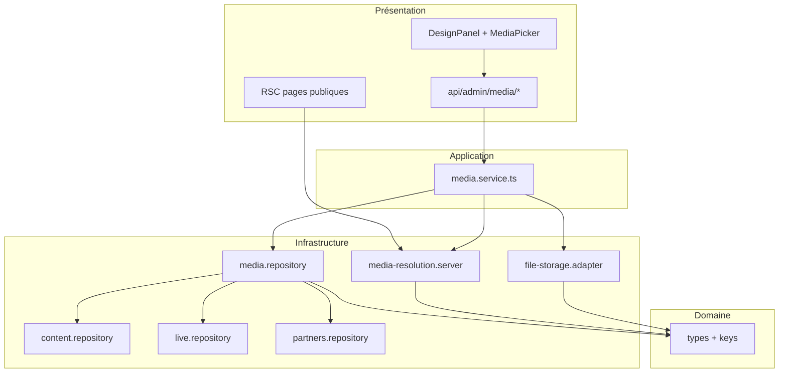

# Architecture — Module Design & Médias

> Refactor Clean Architecture — juillet 2026  
> Comportement produit inchangé ; séparation des responsabilités pour déploiement production.

---

## 1. Structure de dossiers (module médias)

```
src/
├── domain/media/                    # Règles métier pures (sans I/O)
│   ├── types.ts                     # GalleryItem, MediaCatalogEntry, états API
│   ├── keys.ts                      # Clés site_settings, assignables, axes
│   └── index.ts
│
├── application/services/
│   └── media.service.ts             # Orchestration use-cases admin + lecture publique
│
├── infrastructure/media/
│   ├── file-storage.adapter.ts      # FS : upload, delete, validation MIME/taille
│   ├── media.repository.ts          # Persistance store : catalog, settings, collections
│   ├── site-media.parsers.ts        # Parse JSON settings + fallbacks statiques
│   ├── media-resolution.server.ts   # Résolution chemins (server-only, fs.exists)
│   ├── media-resolver.ts            # pngToSvgFallback (pur, sans I/O)
│   └── admin-media.service.ts       # @deprecated — re-export compat
│
├── app/api/admin/media/
│   ├── route.ts                     # GET state · POST upload · PATCH settings
│   ├── library/route.ts             # Bibliothèque fichiers
│   ├── collections/route.ts         # Galerie FIKIN + axes
│   ├── missing/route.ts             # Scan entités sans visuel
│   └── assign/route.ts              # Assignation unifiée (contenu, live, partenaires)
│
├── components/admin/design/           # Présentation admin (tabs, sections)
└── lib/                             # Façade legacy (@deprecated)
    ├── site-media-config.ts         # → domain + infrastructure parsers
    └── media.server.ts              # → media-resolution.server
```

---

## 2. Flux de dépendances



**Règle** : les dépendances pointent vers l'intérieur. Le domaine ne dépend de rien. L'application orchestre. L'infrastructure implémente I/O.

---

## 3. Responsabilités par couche

| Couche | Responsabilité | Exemple |
|--------|----------------|---------|
| **Domain** | Types, clés settings, invariants nommés | `ASSIGNABLE_MEDIA_KEYS`, `MissingMediaItem` |
| **Application** | Use-cases : upload, assign, patch, scan | `uploadMediaFile()`, `assignMedia()` |
| **Infrastructure** | Store, filesystem, parsers JSON | `media.repository`, `file-storage.adapter` |
| **Presentation** | HTTP, React, validation Zod entrante | Routes minces, `DesignPanel` |

---

## 4. Use-cases (media.service)

| Méthode | Description |
|---------|-------------|
| `getMediaState()` | État complet hero + defaults + catalog |
| `uploadMediaFile()` | Valide, sauvegarde FS, catalogue, optionnel setting |
| `patchMediaSettings()` | Hero, defaults, reset |
| `getMediaLibrary()` | Liste ou usages d'un fichier |
| `deleteLibraryAsset()` | Garde-fou usages + delete FS |
| `getMediaCollections()` | FIKIN + axes |
| `saveMediaCollections()` | PUT collections |
| `getMissingMedia()` | Scan cross-entités |
| `assignMedia()` | Point unique : news, live, partners… |
| `getSiteMedia()` … | Résolution lecture publique (re-export) |

---

## 5. Améliorations apportées

### Séparation des responsabilités
- **Avant** : routes avec `getStore`/`updateStore`, delete FS inline, scan missing dupliqué.
- **Après** : routes = auth + parse Zod + service + audit ; logique dans repository/service.

### Modularité
- Upload FS isolé (`file-storage.adapter`).
- Persistance settings/catalog (`media.repository`).
- Résolution publique (`media-resolution.server`).

### Couplage réduit
- `MissingMediaSection` : 1 endpoint `/api/admin/media/assign` au lieu de 3 APIs admin.
- Scan usages centralisé dans `findMediaUsages()` (delete + future cleanup).

### Scalabilité
- Repository prêt pour swap store → PostgreSQL `media_assets` sans toucher routes/UI.
- File-storage adapter remplaçable par S3/R2 en production.

### Maintenabilité
- Types et clés dans `domain/media` (source de vérité).
- `lib/site-media-config.ts` et `lib/media.server.ts` restent en re-export pour migration progressive.
- Validation Zod alignée sur `admin-api.ts` existant.

---

## 6. Compatibilité

- Imports `@/lib/site-media-config` et `@/lib/media.server` **inchangés** pour les pages existantes.
- `@/infrastructure/media/admin-media.service` re-exporte les symboles historiques.
- Réponses JSON des APIs identiques (mêmes champs, mêmes codes HTTP).

---

## 7. Prochaines étapes (hors scope comportement)

1. Cache Next.js pour `getSiteMedia()` (tag `media-settings`).
2. Table PG `media_assets` + stockage objet.
3. Tests unitaires `media.repository` + `media.service`.
4. Migration imports admin vers `@/application/services/media.service`.

---

*CFM ASBL — Architecture Media Module v1.0*
